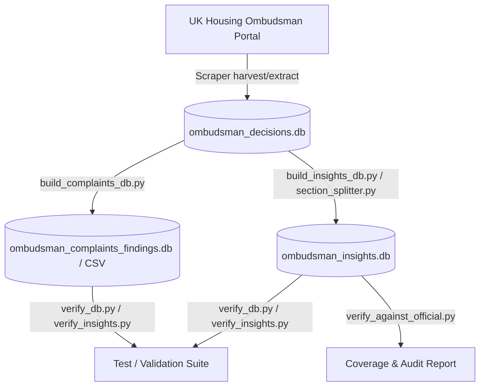

# The Masterplan: UK Housing Ombudsman Disputes Dataset Scraper

## Part 1: Vision & Core Principles (The "Why")

### Housing Problem Solved
Registered Providers (RPs) of social housing and local authorities in the UK operate under heavy regulatory requirements (the Regulator of Social Housing standards, Housing Ombudsman Complaint Handling Code, and Awaab's Law). However, access to comprehensive, structured historical case law and performance benchmarks on housing disputes remains restricted, unindexed, or siloed. 

This project provides a robust, complete, and structurally queried database of disputes directly harvested from the public online archive of the Housing Ombudsman. It translates unstructured report texts into a rich relational schema to support compliance mapping, root-cause analysis, and predictive modeling for landlords and policy advocates.

### Intended Users
- **Housing Professionals & Officers**: To check historical dispute cases, identify best practices, and compare their performance against sector benchmarks.
- **Researchers & Policy Makers**: To perform statistical analyses on complaint rates, upheld ratios, and compensation trends.
- **Legal & Tenant Advocates**: To identify systemic failures or reference relevant precedent findings.

### Core Principles
1. **Data Integrity & Representativeness**: Provide strict checksums, schema validations, and comparison tests against official annual review summaries to ensure statistical representation.
2. **Accessible Formats**: Publish structured datasets as pre-compiled SQLite databases and denormalized CSV formats.
3. **Anonymization & Privacy Preservation**: Rely strictly on the public redacted publications by the Housing Ombudsman. Never enrich or match tenant identifiers to maintain absolute GDPR compliance.

---

## Part 2: System Architecture (The "What")

### Component Breakdown
1. **Scraping Layer (`scraper.py`)**: 
   - Harvests index pages to collect URLs of published decisions.
   - Extracts page titles, URLs, decision dates, and raw page text.
   - Saves results into the unstructured database (`ombudsman_decisions.db`).
2. **Relational Compiler & Extraction Layer (`build_insights_db.py`, `section_splitter.py`)**:
   - Parses the unstructured report texts using text-splitting heuristics to isolate background information, complaint points, and Ombudsman findings.
   - Standardizes landlord names, classifies dispute categories (e.g. Damp & Mould, Pest Control), extracts financial compensation, and identifies cited statutes.
   - Outputs to `ombudsman_insights.db`.
3. **Complaints Summary Layer (`build_complaints_db.py`)**:
   - Compiles a simplified, flat tabular dataset mapping descriptions, classification categories, and specific findings.
   - Outputs to `ombudsman_complaints_findings.db` and the denormalized CSV file.
4. **Verification & Audit Layer (`verify_db.py`, `verify_insights.py`, `verify_against_official.py`)**:
   - Assesses counts, integrity checks, and matches canonical landlord representations against official published data.

---

## Part 3: Technology Stack (The "How")

- **Language**: Python >= 3.11
- **Package Management**: `uv` for fast, reproducible dependency resolution.
- **Web Scraping**: `BeautifulSoup4` + `requests` with robust user-agent headers and retry logic.
- **Storage**: `sqlite3` for zero-configuration, cross-platform relational storage.
- **Testing**: `pytest` for unit, integration, and schema validation.
- **Version Control**: Git with Conventional Commits branches.

---

## Part 4: Sector Context

- **Data Standards**: Landlords standardisation aligns with names cataloged in the Housing Ombudsman's annual reviews. We map dispute findings directly to standard categories (`Damp & Mould`, `Repairs & Maintenance`, etc.).
- **Relevant Standards & Regulation**:
  - **Complaint Handling Code**: Relates to Stage 1 and Stage 2 response timelines (10 and 20 working days). The database computes estimated turnaround days.
  - **Awaab's Law**: Relates to Damp & Mould response speeds.
  - **Regulator of Social Housing (RSH) Consumer Standards**: Outcomes directly highlight landlord service and maladministration failures.
